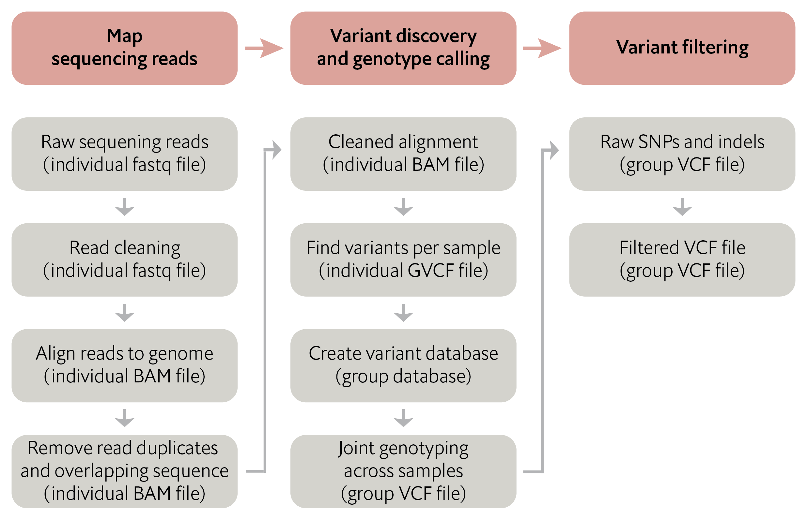
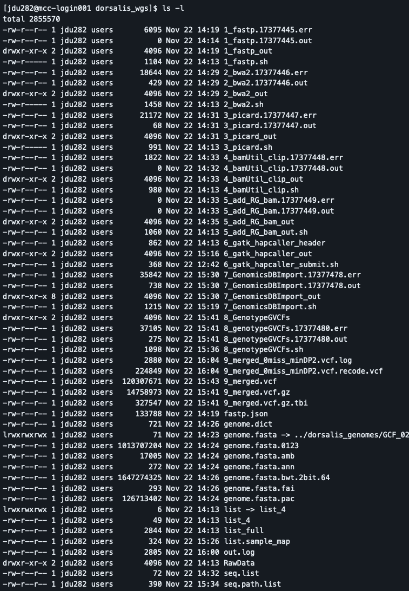

# Whole-genome genotype calling with GATK



You should have the subsetted _B. dorsalis_ read files from module 2 and installed programs from module 3. 

In general, the options we're using here follow the "GATK best practices". See [here](https://gatk.broadinstitute.org/hc/en-us/articles/360035894711-About-the-GATK-Best-Practices) and [here](https://gatk.broadinstitute.org/hc/en-us/sections/360007226651-Best-Practices-Workflows).

_**Data management note:**_ This is a bit of a long process, so when I run it, I label my steps and files in order. I also make a directory called `RawData` where I store the raw data files or soft links to them. As you'll see, each step's output gets put in its own numbered directory. We will talk about each of these steps as we go along, but this approach leads to a directory structure like this where files (job submission file, output, and stdout/stderr) all group together by step:



With the subsetted read files, all of the steps before step 6 (GATK HaplotypeCaller) take under 5 minutes to run. Some are only 1-2 minutes. Step 6 takes ~30 minutes or so, and steps 7 and 8 are around 5 minutes each.

_**Task:**_ Modify your job script template (job_header.sh) so that it looks like this (you don't need to add the comments).
```
#!/bin/bash
#SBATCH --time 2:00:00     
#SBATCH --job-name=1_fastp    # Base name for the job submission file, and all related files
#SBATCH --nodes=1        
#SBATCH --ntasks=32       
#SBATCH --account=coa_jdu282_brazil_bootcamp2023  
#SBATCH --partition=normal
#SBATCH --mail-type ALL    
#SBATCH --mail-user your_email_address
#SBATCH --mem=8g
#SBATCH -e %x.%j.err     # Using %x in the -e and -o options applies the job name (from above) to these output files. %j does the same for job number
#SBATCH -o %x.%j.out
```

_**Task:**_ In your folder on the cluster make a new folder named "RawData" `mkdir RawData`. Then copy the subsetted _B. dorsalis_ read files from the "fastq" folder to the "RawData" folder. Since they all end in either `_1Mreads_R1.fastq` or `_1Mreads_R1.fastq`, we can use a wildcard.

On the command line (don't submit this as a job) run:
```
cp /path/to/your/fastq/folder/*_1Mreads_R1.fastq RawData
cp /path/to/your/fastq/folder/*_1Mreads_R2.fastq RawData
```
_**Question:**_ Why didn't we use *.fastq to move all the subsetted files in one command?

<details>
<summary>Answer</summary> 

The original sequencing read files also end in .fastq. If we ran used *.fastq, both the original and subsetted files would be copied to RawData, which we do not want.

</details>

_**Task:**_ In your folder on the cluster make a symlink to the reference genome 
```
ln -s /scratch/kdu224/bioinf_2024/data/GCA_030710565.1_ASM3071056v1_genomic.fna.gz

```

___

## 1. Read cleaning
Fastp does general read trimming (based on quality score, kmer analysis, etc.), and generates trimmed reads and a html output.

```
mkdir 1_fastp_out

for f in `cat list`; do fastp --in1 ./RawData/$f.1Mreads.R1.fastq --in2 ./RawData/$f.1Mreads.R2.fastq --out1 ./1_fastp_out/$f.R1.fastpOut.fq.gz --out2 ./1_fastp_out/$f.R2.fastpOut.fq.gz  --detect_adapter_for_pe --trim_poly_g --thread 20 --overrepresentation_analysis --length_required 35 --compression 9 -h ./1_fastp_out/$f.html; done
```

Check out the html output to see what fastp can figure out for you.

___

## 2. Genome alignment


## 3. Remove duplicate reads


## 4. Remove overlapping sequence


## 5. Add read group information


## 6. GATK HaplotypeCaller


## 7. GATK GenomicsDBImport
Sample map

## 8. GATK GenotypeGVCFs


## 9. Merging VCFs


## Filter VCF